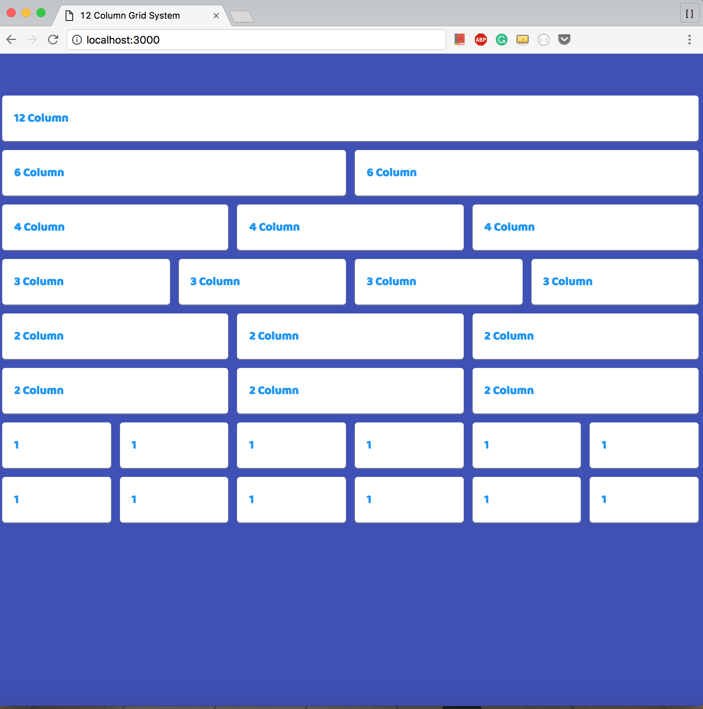

# RESPONSIVE GRID LAYOUT WITHOUT FRAMEWORK
- - -
This very simple responsive grid layout is written in css from scratch without the use of any framework. This responsive grid-view has 12 columns, and has a total `width` of 100%, and will shrink and expand as you resize the browser window. Here is how the percentage of each column was calculated: 

```javascript
	100% / number of columns = width of new column.
```

Moreover, this grid system uses `media queries`: 

```css
	@media only screen and (max-width: 500px) {
	/* css ruleset here */
}

```

- - - 

### WIDE

- - -

### MEDIUM

- - - 


### SMALL
